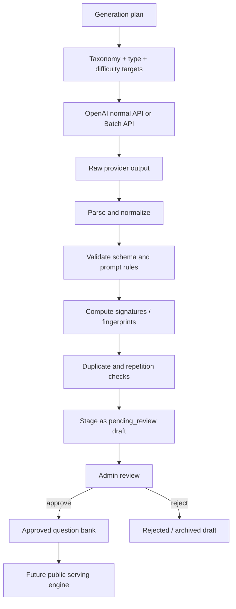

# AI Generation Lifecycle Diagram

```mermaid
flowchart TD
    Plan[Generation plan] --> Targets[Taxonomy + type + difficulty targets]
    Targets --> Provider[OpenAI normal API or Batch API]
    Provider --> Raw[Raw provider output]
    Raw --> Parse[Parse and normalize]
    Parse --> Validate[Validate schema and prompt rules]
    Validate --> Fingerprint[Compute signatures / fingerprints]
    Fingerprint --> Duplicate[Duplicate and repetition checks]
    Duplicate --> Draft[Stage as pending_review draft]
    Draft --> Review[Admin review]
    Review -->|approve| Approved[Approved question bank]
    Review -->|reject| Rejected[Rejected / archived draft]
    Approved --> Serving[Future public serving engine]
```
