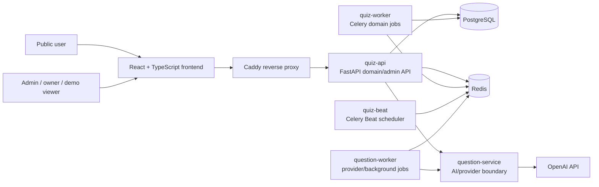

# Architecture Overview Diagram

```mermaid
flowchart LR
    User[Public user] --> Frontend[React + TypeScript frontend]
    Admin[Admin / owner / demo viewer] --> Frontend
    Frontend --> Caddy[Caddy reverse proxy]
    Caddy --> QuizAPI[quiz-api
FastAPI domain/admin API]
    QuizAPI --> Postgres[(PostgreSQL)]
    QuizAPI --> Redis[(Redis)]
    QuizAPI --> QuestionService[question-service
AI/provider boundary]
    QuestionService --> OpenAI[OpenAI API]
    QuizWorker[quiz-worker
Celery domain jobs] --> Redis
    QuizWorker --> Postgres
    QuizBeat[quiz-beat
Celery Beat scheduler] --> Redis
    QuestionWorker[question-worker
provider/background jobs] --> Redis
    QuestionWorker --> QuestionService
```
