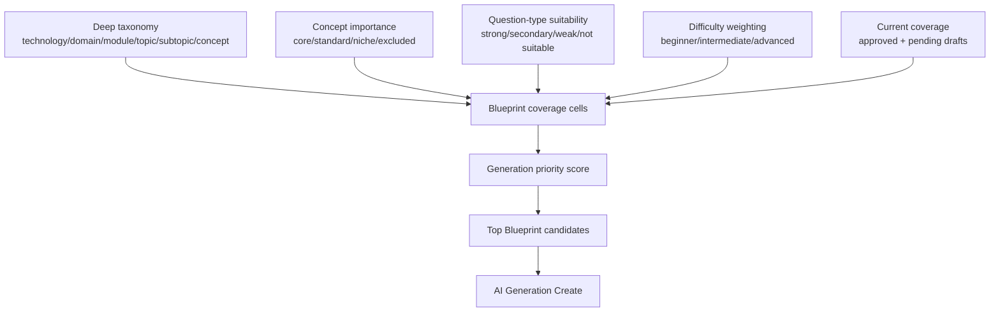

# Backend Intelligence Layer Diagram

```mermaid
flowchart TD
    Taxonomy[Deep taxonomy
technology/domain/module/topic/subtopic/concept]
    Importance[Concept importance
core/standard/niche/excluded]
    Suitability[Question-type suitability
strong/secondary/weak/not suitable]
    Difficulty[Difficulty weighting
beginner/intermediate/advanced]
    Coverage[Current coverage
approved + pending drafts]
    Taxonomy --> Blueprint[Blueprint coverage cells]
    Importance --> Blueprint
    Suitability --> Blueprint
    Difficulty --> Blueprint
    Coverage --> Blueprint
    Blueprint --> Priority[Generation priority score]
    Priority --> Candidates[Top Blueprint candidates]
    Candidates --> Generation[AI Generation Create]
```
