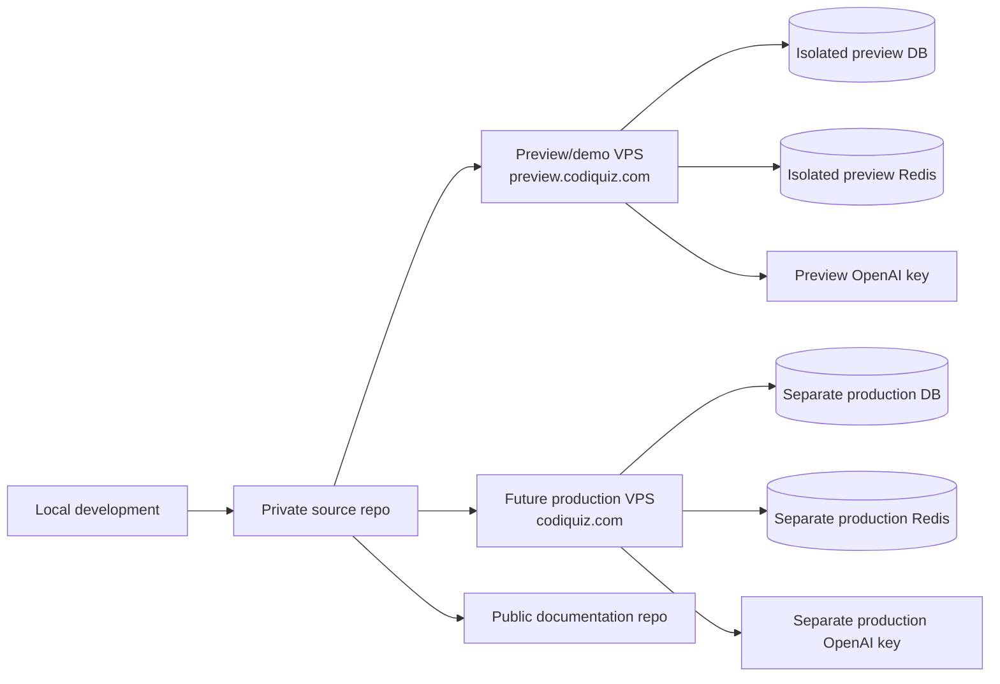

# Deployment Environments Diagram

```mermaid
flowchart LR
    Local[Local development] --> PrivateRepo[Private source repo]
    PrivateRepo --> Preview[Preview/demo VPS
preview.codiquiz.com]
    PrivateRepo --> FutureProd[Future production VPS
codiquiz.com]
    Preview --> PreviewDB[(Isolated preview DB)]
    Preview --> PreviewRedis[(Isolated preview Redis)]
    Preview --> PreviewKey[Preview OpenAI key]
    FutureProd --> ProdDB[(Separate production DB)]
    FutureProd --> ProdRedis[(Separate production Redis)]
    FutureProd --> ProdKey[Separate production OpenAI key]
    PrivateRepo --> PublicDocs[Public documentation repo]
```
