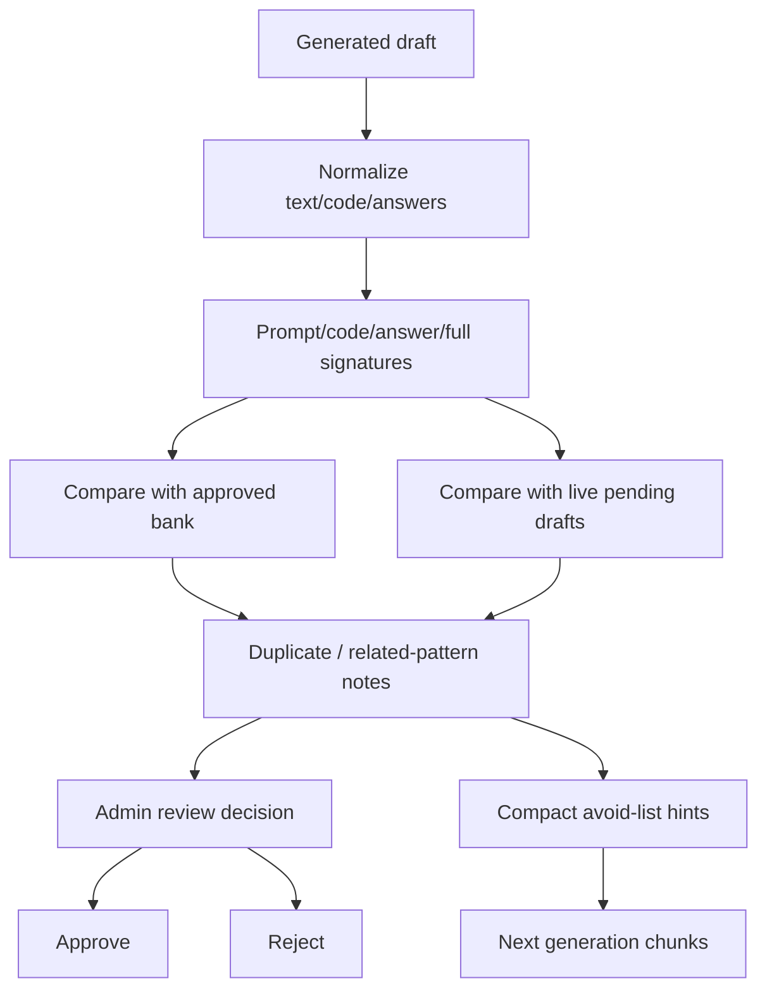

# Backend Quality Engine Diagram

```mermaid
flowchart TD
    Draft[Generated draft] --> Normalize[Normalize text/code/answers]
    Normalize --> Signatures[Prompt/code/answer/full signatures]
    Signatures --> ApprovedCheck[Compare with approved bank]
    Signatures --> PendingCheck[Compare with live pending drafts]
    ApprovedCheck --> Warnings[Duplicate / related-pattern notes]
    PendingCheck --> Warnings
    Warnings --> Review[Admin review decision]
    Review --> Approved[Approve]
    Review --> Rejected[Reject]
    Warnings --> AvoidList[Compact avoid-list hints]
    AvoidList --> NextGeneration[Next generation chunks]
```
